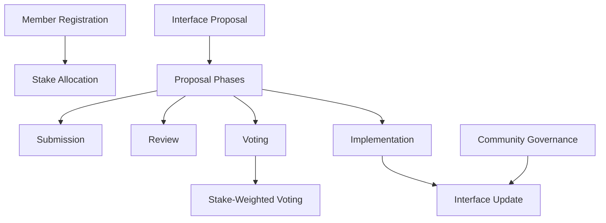

# Install Interface

A decentralized governance platform for collaborative software interface development and management.

## Overview

Install Interface provides a transparent, stake-based mechanism for proposing, reviewing, and implementing software interface improvements through a community-driven process.

## Key Features

- **Stake-Based Governance**: Participants contribute and stake tokens to influence proposal outcomes
- **Proposal Lifecycle Management**: Structured phases from submission to implementation
- **Transparent Voting**: Weighted voting mechanism that considers participant stakes
- **Flexible Interface Development**: Support for various software interface improvement proposals

## Architecture



### Core Components

1. **Membership System**
   - Token-based stake participation
   - Dynamic stake allocation
   - Proposal creation rights

2. **Proposal Lifecycle**
   - Four distinct phases: Submission, Review, Voting, Implementation
   - Stake-threshold activation
   - Transparent voting mechanism

3. **Governance Mechanics**
   - Weighted voting based on participant stakes
   - Minimum participation requirements
   - Democratic decision-making process

## Contract Documentation

### interface-manager.clar

The core contract managing interface development governance.

#### Key Functions

1. Member Management
```clarity
(define-public (register-member (initial-stake uint)))
(define-public (increase-stake (additional-stake uint)))
```

2. Proposal Management
```clarity
(define-public (create-proposal 
    (title (string-ascii 100))
    (description (string-utf8 500))
    (target-stake uint)
    (implementation-link (string-ascii 255))))
```

3. Voting and Governance
```clarity
(define-public (vote-on-proposal (proposal-id uint) (vote-for bool)))
(define-public (activate-proposal (proposal-id uint)))
(define-public (finalize-proposal (proposal-id uint)))
```

## Getting Started

### Prerequisites

- Clarinet
- Stacks wallet
- Interface tokens for staking

### Basic Usage

1. Register as a member:
```clarity
(contract-call? .interface-manager register-member u1000)
```

2. Create an interface proposal:
```clarity
(contract-call? .interface-manager create-proposal 
    "Enhanced User Interface" 
    "Proposal for improving navigation and accessibility" 
    u5000 
    "https://example.com/interface-spec")
```

3. Vote on a proposal:
```clarity
(contract-call? .interface-manager vote-on-proposal u1 true)
```

## Function Reference

### Member Functions

| Function | Description | Parameters |
|----------|-------------|------------|
| register-member | Join the platform | initial-stake: uint |
| increase-stake | Add more stake | additional-stake: uint |

### Proposal Functions

| Function | Description | Parameters |
|----------|-------------|------------|
| create-proposal | Submit interface improvement | title: string, description: string, target-stake: uint, implementation-link: string |
| vote-on-proposal | Cast vote | proposal-id: uint, vote-for: bool |
| activate-proposal | Begin proposal voting | proposal-id: uint |
| finalize-proposal | Complete voting phase | proposal-id: uint |

## Development

### Testing

1. Clone the repository
2. Install Clarinet
3. Run tests:
```bash
clarinet test
```

### Local Development

1. Start Clarinet console:
```bash
clarinet console
```

2. Deploy contract:
```bash
clarinet deploy
```

## Security Considerations

### Governance Protection
- Stake-weighted voting prevents token concentration
- Mandatory phase progression
- Transparent proposal tracking

### Participation Safeguards
- Minimum stake requirements
- One vote per proposal per member
- Clear proposal state management

### Known Limitations
- Initial stake-based voting mechanism
- Basic implementation of interface proposal system

## Contributing

Interested in improving Install Interface? 
- Review our contribution guidelines
- Submit proposals through the smart contract
- Participate in community discussions

## License

[Insert appropriate open-source license]